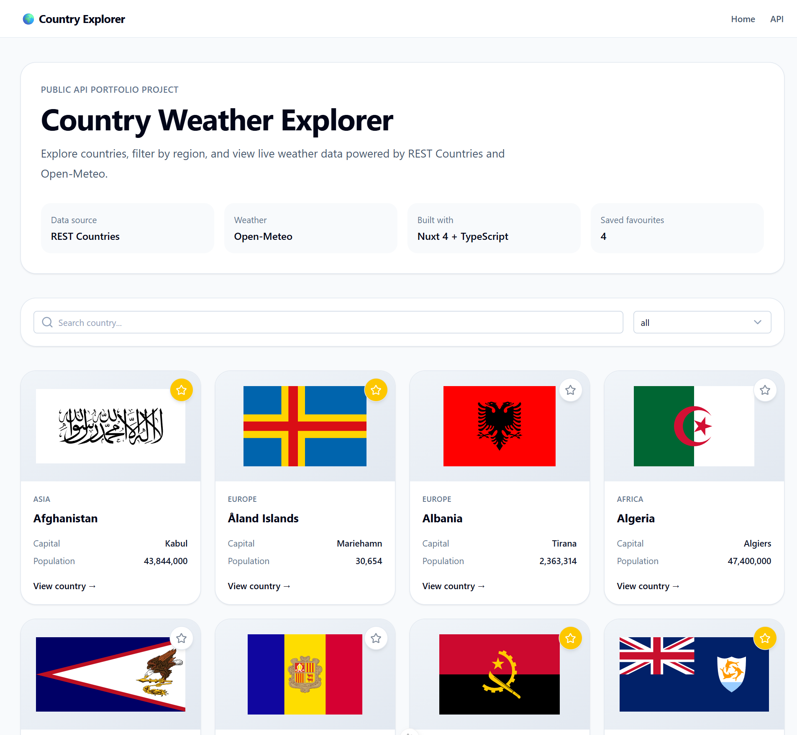
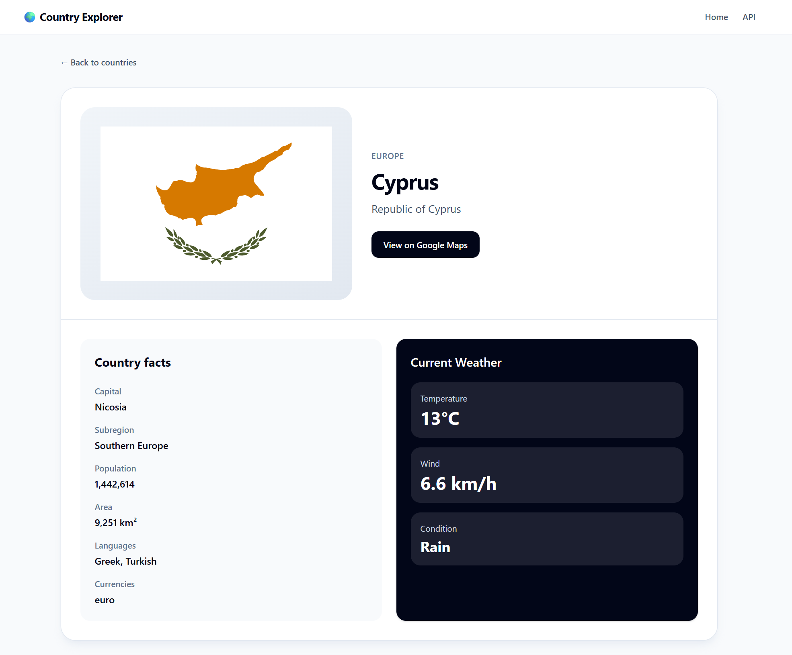

# 🌍 Country Weather Explorer

A modern frontend application built with **Nuxt 4** that allows users to explore countries and view real-time weather data using public APIs.

---

## ✨ Features

- 🌐 Browse all countries
- 🔍 Search and filter by region
- ⭐ Save favourite countries (localStorage)
- 🌦️ View real-time weather per country
- ⚡ Server-side API caching
- 🎯 Clean, semantic UI with Tailwind CSS

---

## 🧠 Tech Stack

- **Nuxt 4**
- **Vue 3 (Composition API)**
- **TypeScript**
- **Tailwind CSS + Nuxt UI**
- **Nitro Server API**

---

## 🔌 APIs Used

- 🌍 REST Countries API
- 🌦️ Open-Meteo API

---

## 🏗️ Architecture

- `/server/api` → API layer (data fetching + caching)
- `/app/composables` → reusable logic
- `/shared/types` → TypeScript models
- `useAsyncData` → reactive data fetching
- `defineCachedEventHandler` → API caching strategy

---

## 📸 Screenshots

### Home


### Country Detail


## 🚀 Setup

```bash
pnpm install
pnpm dev
